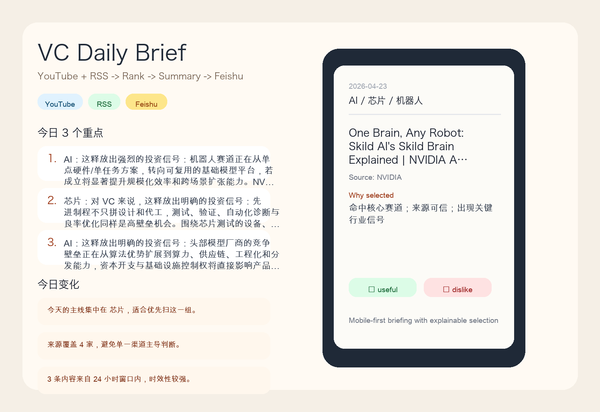
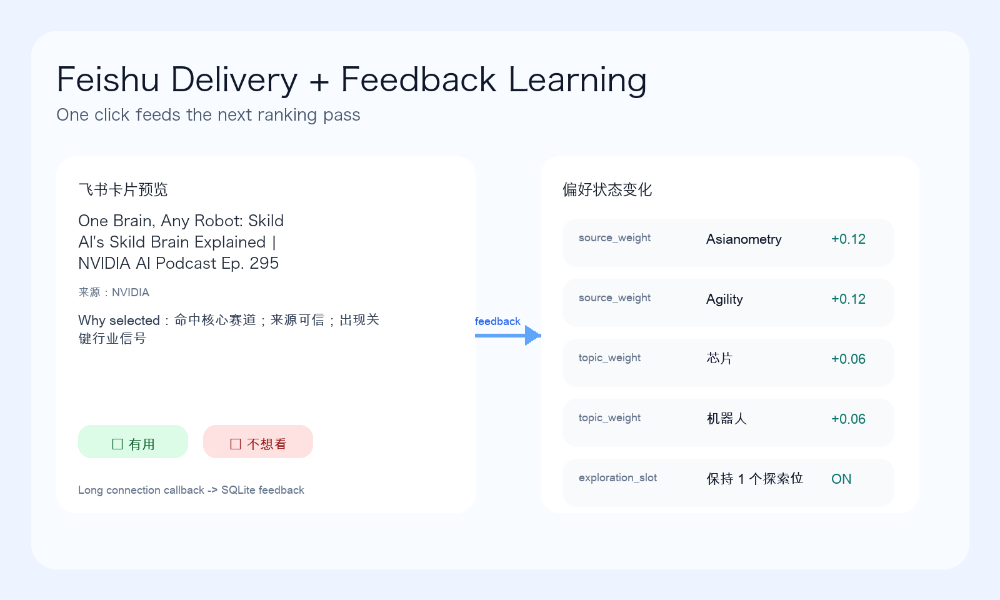
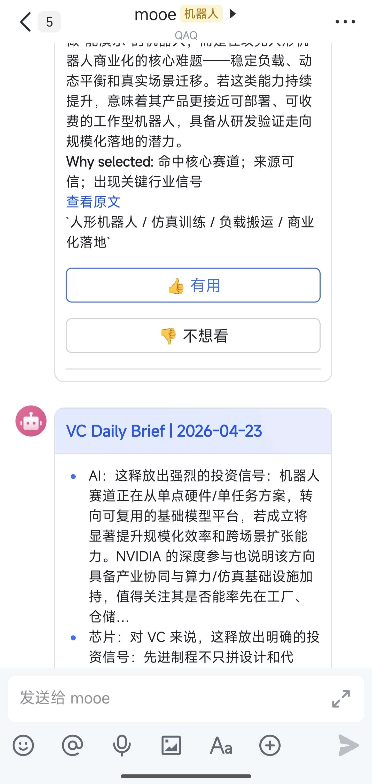

# VC 信息聚合 Agent

[](https://github.com/huachabobo/vc-daily-brief-agent/actions/workflows/pytest.yml)

面向 VC 合伙人的信息聚合 Agent 原型。这个项目优先解决四件事：抓到真实内容、过滤噪音、生成手机友好的日报、把用户反馈回写到下一轮排序。

## Preview





真实飞书发送截图：



## 体验亮点

- `今日变化`：日报不会只堆内容，还会总结今天相比常规观察窗口最值得先看的变化
- `Why selected`：每条内容都会说明为什么它被选进今日简报，强化可解释性
- `多真实源`：当前同时接入 `YouTube` 与 `RSS/Atom`，避免只靠单一平台
- `飞书反馈学习`：用户点击 `👍 / 👎` 后，source/topic/phrase 权重会影响下一轮排序
- `显式用户画像`：可以在 `config/user_profile.yaml` 里直接声明重点赛道、偏好来源和屏蔽条件
- `自然语言偏好`：可以像 ChatGPT Pulse 一样直接描述“多看什么 / 少看什么 / 简报几条”，AI 会把它编译成结构化画像 patch
- `轻量配置向导`：`python scripts/bootstrap.py` 可以在终端里生成 `.env`，不需要额外做 WebUI

## 交付物

- 设计文档：[design.md](design.md)
- 可运行代码：`src/` + `scripts/`
- 实际生成简报：[sample_output/2026-04-23_brief.md](sample_output/2026-04-23_brief.md)

## 当前原型范围

- 真实接入 `YouTube Data API` 与 `RSS/Atom feed`
- 基于规则做冷启动过滤、排序和去重
- 调用 OpenAI 兼容接口生成结构化摘要，失败时降级为抽取式摘要
- 输出 Markdown 简报到 `sample_output/`
- 支持飞书 App Bot / Webhook 发送
- 支持飞书 `HTTP 回调` 和 `长连接` 两种反馈接收方式
- 反馈写入 SQLite，并更新 source/topic/phrase 偏好权重

## 架构概览

```text
YouTube / RSS -> Raw Store(SQLite) -> Normalize/Dedup -> Rank -> LLM Summary
                                -> Brief Composer -> Markdown / Feishu
                                                     ^
                                                     |
                                          Feedback / Long Connection
```

## 目录结构

```text
.
├── README.md
├── design.md
├── config/
│   └── sources.yaml
├── sample_output/
│   └── 2026-04-23_brief.md
├── scripts/
│   ├── run_once.py
│   └── serve_feedback.py
├── src/
│   └── vc_agent/
└── tests/
```

## 快速开始

1. 创建环境

```bash
cd vc-daily-brief-agent
uv venv
source .venv/bin/activate
uv pip install -r requirements.txt
```

2. 配置环境变量

```bash
cp .env.example .env
```

或者直接运行终端向导：

```bash
python scripts/bootstrap.py
```

至少需要：
- `YOUTUBE_API_KEY`

建议配置：
- `OPENAI_API_KEY`
- `OPENAI_BASE_URL`
- `OPENAI_MODEL`

如果要推送到飞书，还需要二选一：
- `FEISHU_WEBHOOK_URL`
- 或 `FEISHU_APP_ID`、`FEISHU_APP_SECRET`，再加 `FEISHU_CHAT_ID` 或 `FEISHU_RECEIVE_ID_TYPE` + `FEISHU_RECEIVE_ID`

反馈接收方式：
- `FEISHU_CALLBACK_MODE=long_connection`：推荐，不需要公网 URL
- `FEISHU_CALLBACK_MODE=http`：需要把 `/feishu/callback` 暴露成 HTTPS 地址

3. 配置内容源

编辑 [config/sources.yaml](config/sources.yaml)：
- `platform: youtube` 时填写 `channel_id`
- `platform: rss` 时填写 `feed_url`

默认示例里已经带了 4 个 YouTube 白名单频道和 3 个 RSS 高信号源。

4. 可选：配置用户画像

编辑 [config/user_profile.yaml](config/user_profile.yaml)，可以直接声明：
- `focus_topics`
- `preferred_sources`
- `blocked_sources`
- `blocked_keywords`
- `weight_overrides.topics / sources / keywords`
- `digest.max_items`
- `digest.exploration_slots`

也可以直接用自然语言更新画像：

```bash
python scripts/update_profile.py --text "我更关注 AI infra 和机器人商业化落地，优先 NVIDIA、SemiEngineering，少给我纯学术 benchmark，日报控制在 5 条。"
```

如果想先看 AI 会怎么改，不立刻写入文件：

```bash
python scripts/update_profile.py --text "更关注芯片和机器人，少看 benchmark" --dry-run
```

## 运行

生成一份日报：

```bash
python scripts/run_once.py
```

成功后会：
- 抓取 YouTube / RSS 内容
- 把原始数据和分析结果写入 `data/vc_agent.db`
- 在 `sample_output/` 生成日报
- 若配置了飞书，自动尝试发送

启动反馈服务：

```bash
python scripts/serve_feedback.py
```

`serve_feedback.py` 会按 `FEISHU_CALLBACK_MODE` 自动切换：
- `long_connection`：启动飞书官方 SDK 的 WebSocket 客户端
- `http`：启动 FastAPI，提供 `GET /health` 与 `POST /feishu/callback`

本地调试 HTTP 回调时，可直接执行：

```bash
curl -X POST http://127.0.0.1:8787/feishu/callback \
  -H "Content-Type: application/json" \
  -d '{"item_id": 1, "label": "useful"}'
```

## 7×24 运行建议

原型把“抓取生成”和“反馈接收”拆成两条链路：
- `python scripts/run_once.py`：适合由 `cron` 或云调度器每天触发一次
- `python scripts/serve_feedback.py`：适合在演示期或长期服务中常驻运行，用于接收飞书反馈

如果在 macOS/Linux 上做最小部署，可以用 `cron`：

```bash
0 8 * * * cd /path/to/vc-daily-brief-agent && ./.venv/bin/python scripts/run_once.py >> logs/run_once.log 2>&1
```

仓库里也提供了最小模板：
- [ops/cron.example](ops/cron.example)：每天生成简报
- [ops/serve_feedback.launchd.plist.example](ops/serve_feedback.launchd.plist.example)：macOS 下常驻飞书反馈服务

这样可以把题目中的“7×24 自动运行”要求落到实际配置文件，同时保持原型结构简单。

## 飞书接入建议

最推荐的演示路径是：
- 用 App Bot 私聊发送日报
- 用 `FEISHU_CALLBACK_MODE=long_connection` 接收 `👍/👎` 反馈

原因：
- 不需要配置隧道或公网回调地址
- 反馈链路更稳定
- 更适合本地开发和面试演示

如果只发私聊，不需要 `chat_id`，可以配置：
- `FEISHU_RECEIVE_ID_TYPE=open_id|user_id|email`
- `FEISHU_RECEIVE_ID=<对应接收者 ID>`

如果你在飞书私聊里直接给机器人发文本消息，也可以更新偏好。例如：

```text
更关注 AI infra 和机器人商业化落地，优先 NVIDIA、SemiEngineering，少给我纯学术 benchmark，日报控制在 5 条。
```

机器人会自动把这段话编译成画像 patch，并回复本次更新结果。

## 测试

```bash
pytest
```

当前覆盖：
- 标题近似去重
- 规则打分抑制噪音
- 简报分组与条数控制
- 反馈回写与偏好更新
- 用户画像过滤与偏好加权

## 演示顺序

1. 先打开 [sample_output/2026-04-23_brief.md](sample_output/2026-04-23_brief.md)，说明这是一次真实运行产物。
2. 运行 `python scripts/run_once.py`，展示抓取、筛选、摘要、发送链路。
3. 保持 `python scripts/serve_feedback.py` 在长连接模式运行。
4. 在飞书里点击 `👍` 或 `👎`，再查看 SQLite 中的 `feedback` 和 `preference_state`。

可以直接这样介绍：

> 我没有先追求多平台全覆盖，而是先把 VC 最在意的闭环跑通：从高信号白名单源抓内容，用可解释规则做冷启动过滤，再用 LLM 生成结构化摘要，并通过飞书把日报送到手机端。用户在卡片上点“有用 / 不想看”后，反馈会实时回写数据库，并影响下一轮排序。

## 提交前检查

- 提交 [sample_output/2026-04-23_brief.md](sample_output/2026-04-23_brief.md) 这份真实生成的简报
- 不要提交 `.env`
- 不要提交 `.venv/`、`.pytest_cache/`、`data/vc_agent.db`
- 若走压缩包，建议只保留 `README.md`、`design.md`、`config/`、`scripts/`、`src/`、`tests/`、`sample_output/`

## 已知限制

- 原型已真实接入 YouTube 与 RSS，X 与公众号在设计文档中给出扩展方案
- 去重只做 `videoId` 和标题近似，不做跨平台语义聚类
- 飞书长连接只支持企业自建应用，当前接的是新版 `card.action.trigger`
- 若切回 HTTP 回调并开启额外加密策略，需要补充解密逻辑
