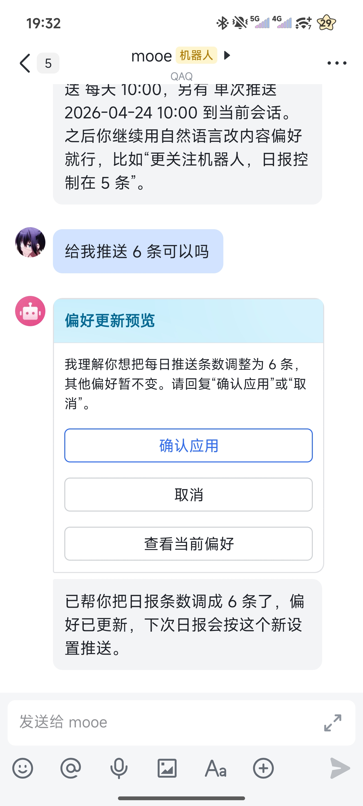
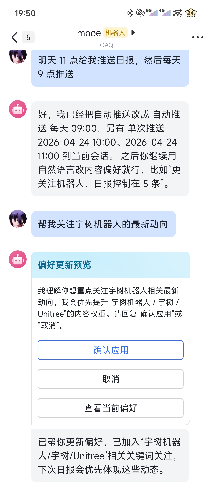

# VC 信息聚合 Agent

[](https://github.com/huachabobo/vc-daily-brief-agent/actions/workflows/pytest.yml)

面向 VC 合伙人的信息聚合 Agent 原型。这个项目优先解决四件事：抓到真实内容、过滤噪音、生成手机友好的日报、把用户反馈回写到下一轮排序。

## Preview


真实飞书发送截图：


真实飞书交互截图：

<p>
  
  
</p>

## 体验亮点

- `今日变化`：日报不会只堆内容，还会总结今天相比常规观察窗口最值得先看的变化
- `Why selected`：每条内容都会说明为什么它被选进今日简报，强化可解释性
- `多真实源`：当前同时接入 `YouTube` 与 `RSS/Atom`，避免只靠单一平台
- `飞书反馈学习`：用户点击 `👍 / 👎` 后，source/topic/phrase 权重会影响下一轮排序
- `显式用户画像`：可以在 `config/user_profile.yaml` 里声明默认重点赛道、偏好来源和屏蔽条件；私聊用户第一次交互后会复制出自己的独立画像
- `自然语言偏好`：可以像 ChatGPT Pulse 一样直接描述“多看什么 / 少看什么 / 简报几条”，AI 会把它编译成结构化画像 patch
- `自然语言调度`：可以直接在飞书里说“每天早上 8 点推送日报”、“工作日 9 点、周末 10 点半推送”或“现在生成日报”；规则没命中时会再调用 LLM 做需求理解，再修改受控配置
- `AI 工具调度`：飞书私聊消息会先由 LLM 判断要调用哪些内部工具，再按顺序执行并汇总回复，适合“一句话同时改时间、改内容、立刻生成”的复合需求
- `轻量配置向导`：`python scripts/bootstrap.py` 可以在终端里生成 `.env`，不需要额外做 WebUI

## 交付物

- 设计文档：[design.md](design.md)
- 可运行代码：`src/` + `scripts/`
- 实际生成简报：[sample_output/2026-04-23_brief.md](sample_output/2026-04-23_brief.md)

## 当前原型范围

- 真实接入 `YouTube Data API` 与 `RSS/Atom feed`
- 基于规则做冷启动过滤、排序和去重
- 调用 OpenAI 兼容接口生成结构化摘要，失败时降级为抽取式摘要
- 输出 Markdown 简报到 `sample_output/`；私聊用户的实时产物会写到 `sample_output/users/<user>/`
- 支持飞书 App Bot / Webhook 发送
- 支持飞书 `HTTP 回调` 和 `长连接` 两种反馈接收方式，都会按 `open_id/chat_id` 路由到对应用户运行态
- 反馈写入 SQLite，并更新 source/topic/phrase 偏好权重；私聊用户会使用各自独立的 `db / profile / delivery preferences`

## 架构概览

```text
YouTube / RSS -> Raw Store(SQLite) -> Normalize/Dedup -> Rank -> LLM Summary
                                -> Brief Composer -> Markdown / Feishu
                                                     ^
                                                     |
                                          Feedback / Long Connection
```

## 目录结构

```text
.
├── README.md
├── design.md
├── config/
│   ├── sources.yaml
│   └── user_profile.yaml
├── data/
│   └── users/
│       └── <user>/
│           ├── delivery_preferences.json
│           ├── user_profile.yaml
│           └── vc_agent.db
├── sample_output/
│   ├── 2026-04-23_brief.md
│   └── users/
│       └── <user>/
│           └── 2026-04-23_brief.md
├── scripts/
│   ├── run_once.py
│   └── serve_feedback.py
├── src/
│   └── vc_agent/
└── tests/
```

## 快速开始

1. 创建环境

```bash
cd vc-daily-brief-agent
uv venv
source .venv/bin/activate
uv pip install -r requirements.txt
```

2. 配置环境变量

```bash
cp .env.example .env
```

或者直接运行终端向导：

```bash
python scripts/bootstrap.py
```

至少需要：
- `YOUTUBE_API_KEY`

建议配置：
- `OPENAI_API_KEY`
- `OPENAI_BASE_URL`
- `OPENAI_MODEL`

如果要推送到飞书，还需要二选一：
- `FEISHU_WEBHOOK_URL`
- 或 `FEISHU_APP_ID`、`FEISHU_APP_SECRET`，再加 `FEISHU_CHAT_ID` 或 `FEISHU_RECEIVE_ID_TYPE` + `FEISHU_RECEIVE_ID`

反馈接收方式：
- `FEISHU_CALLBACK_MODE=long_connection`：推荐，不需要公网 URL
- `FEISHU_CALLBACK_MODE=http`：需要把 `/feishu/callback` 暴露成 HTTPS 地址

3. 配置内容源

编辑 [config/sources.yaml](config/sources.yaml)：
- `platform: youtube` 时填写 `channel_id`
- `platform: rss` 时填写 `feed_url`

默认示例里已经带了 4 个 YouTube 白名单频道和 3 个 RSS 高信号源。

4. 可选：配置用户画像

根目录的 [config/user_profile.yaml](config/user_profile.yaml) 是默认画像模板，适合：
- CLI 单次运行
- 作为飞书私聊用户第一次交互时的种子配置

它可以直接声明：
- `focus_topics`
- `preferred_sources`
- `preferred_keywords`
- `blocked_sources`
- `blocked_keywords`
- `weight_overrides.topics / sources / keywords`
- `digest.max_items`
- `digest.exploration_slots`

也可以直接用自然语言更新默认画像：

```bash
python scripts/update_profile.py --text "我更关注 AI infra 和机器人商业化落地，优先 NVIDIA、SemiEngineering，少给我纯学术 benchmark，日报控制在 5 条。"
```

也支持完全自由的偏好短语，例如：

```bash
python scripts/update_profile.py --text "我想多看客户验证、商业化落地、供应链和开源模型，少给我纯 demo。"
```

如果想先看 AI 会怎么改，不立刻写入文件：

```bash
python scripts/update_profile.py --text "更关注芯片和机器人，少看 benchmark" --dry-run
```

如果要改某个私聊用户已经迁出的画像，可以显式指定：

```bash
python scripts/update_profile.py \
  --profile-path data/users/<user>/user_profile.yaml \
  --text "更关注机器人商业化落地，日报控制在 5 条。"
```

如果在飞书私聊里直接发偏好描述，机器人会先回一张偏好预览卡片。你可以直接点：
- `确认应用`
- `取消`
- `查看当前偏好`

同时也保留文本指令：
- `确认应用`
- `取消`
- `查看当前偏好`
- `撤销上一次偏好修改`

另外还支持两类自然语言操作：
- 改每日推送时间：`每天早上 8 点推送日报`、`改成晚上 6 点半推送`
- 改成按周规则：`工作日 9 点推送，周末 10 点半推送`
- 立刻生成一版：`现在生成日报`、`来一版日报`

## 运行

生成一份日报：

```bash
python scripts/run_once.py
```

成功后会：
- 抓取 YouTube / RSS 内容
- 把原始数据和分析结果写入默认运行态的 `data/vc_agent.db`
- 在默认输出目录 `sample_output/` 生成日报
- 若配置了飞书，自动尝试发送

启动反馈服务：

```bash
python scripts/serve_feedback.py
```

`serve_feedback.py` 会按 `FEISHU_CALLBACK_MODE` 自动切换：
- `long_connection`：启动飞书官方 SDK 的 WebSocket 客户端
- `http`：启动 FastAPI，提供 `GET /health` 与 `POST /feishu/callback`

如果通过飞书私聊与机器人交互，系统会为每个用户创建独立运行态：
- `data/users/<user>/vc_agent.db`
- `data/users/<user>/user_profile.yaml`
- `data/users/<user>/delivery_preferences.json`
- `sample_output/users/<user>/`

这意味着：
- 你在私聊里改偏好、改推送时间、点 `👍/👎`，只会影响自己的推荐
- 根目录 `config/user_profile.yaml` 和 `sample_output/2026-04-23_brief.md` 主要用于默认配置与提交样例

本地调试 HTTP 回调时，可直接执行：

```bash
curl -X POST http://127.0.0.1:8787/feishu/callback \
  -H "Content-Type: application/json" \
  -d '{"item_id": 1, "label": "useful"}'
```

## 7×24 运行建议

原型把“抓取生成”和“反馈接收”拆成两条链路：
- `python scripts/run_once.py`：适合由 `cron` 或云调度器每天触发一次
- `python scripts/serve_feedback.py`：适合在演示期或长期服务中常驻运行，用于接收飞书反馈，同时也会读取自然语言设置的每日推送时间并按时触发

如果在 macOS/Linux 上做最小部署，可以用 `cron`：

```bash
0 8 * * * cd /path/to/vc-daily-brief-agent && ./.venv/bin/python scripts/run_once.py >> logs/run_once.log 2>&1
```

仓库里也提供了最小模板：
- [ops/cron.example](ops/cron.example)：每天生成简报
- [ops/serve_feedback.launchd.plist.example](ops/serve_feedback.launchd.plist.example)：macOS 下常驻飞书反馈服务

这样可以把题目中的“7×24 自动运行”要求落到实际配置文件，同时保持原型结构简单。

## 飞书接入建议

最推荐的演示路径是：
- 用 App Bot 私聊发送日报
- 用 `FEISHU_CALLBACK_MODE=long_connection` 接收 `👍/👎` 反馈

原因：
- 不需要配置隧道或公网回调地址
- 反馈链路更稳定
- 更适合本地开发和面试演示

如果只发私聊，不需要 `chat_id`，可以配置：
- `FEISHU_RECEIVE_ID_TYPE=open_id|user_id|email`
- `FEISHU_RECEIVE_ID=<对应接收者 ID>`

如果你在飞书私聊里直接给机器人发文本消息，也可以更新偏好。例如：

```text
更关注 AI infra 和机器人商业化落地，优先 NVIDIA、SemiEngineering，少给我纯学术 benchmark，日报控制在 5 条。
```

机器人会先生成一张自然语言预览卡片，点 `确认应用` 后才真正写入画像；如果你更喜欢文本交互，也可以直接回复 `确认应用`、`取消` 或 `查看当前偏好`。

如果你希望直接用聊天控制调度，也可以这样说：

```text
每天早上 8 点推送日报
工作日 9 点推送，周末 10 点半推送
改成晚上 6 点半推送
查看当前推送时间
先暂停每日推送
现在生成日报
```

## 飞书配置教程

如果只是为了面试演示，我建议走这一条最稳的路径：
- `App Bot`
- `私聊发送`
- `FEISHU_CALLBACK_MODE=long_connection`

这样不需要公网回调地址，配置最少，也最适合本地跑 demo。

### 1. 在飞书开放平台创建应用

1. 创建一个 `企业自建应用`
2. 在左侧 `添加应用能力` 里启用 `机器人`
3. 发布一个版本，确保机器人能力已经生效

### 2. 选择发送目标

有两种常见方式：
- `私聊`：推荐，配置 `FEISHU_RECEIVE_ID_TYPE` + `FEISHU_RECEIVE_ID`
- `群聊`：配置 `FEISHU_CHAT_ID`

如果走私聊，代码当前支持：
- `FEISHU_RECEIVE_ID_TYPE=open_id`
- `FEISHU_RECEIVE_ID_TYPE=user_id`
- `FEISHU_RECEIVE_ID_TYPE=email`

推荐优先使用 `open_id`，最稳定；`email` 适合你已经确认当前租户里能直接识别该邮箱的情况。

### 3. 配置事件与回调

如果你要让机器人支持：
- 点击 `👍 / 👎`
- 私聊里直接发自然语言改偏好
- 私聊里直接改推送时间或立刻生成日报

那就需要开启事件订阅。

推荐配置：
- `订阅方式`：`长连接`
- 事件：`im.message.receive_v1`
- 事件：`card.action.trigger`

长连接模式下：
- 不需要配置公网 `Request URL`
- 不需要额外跑隧道
- 只要本地保持 `python scripts/serve_feedback.py` 运行即可

如果你必须使用 HTTP 回调，再切到：
- `FEISHU_CALLBACK_MODE=http`
- 把 `/feishu/callback` 暴露成 HTTPS 地址
- 如有需要再配置 `FEISHU_VERIFY_TOKEN`

### 4. `.env` 最小配置示例

私聊 + 长连接的推荐配置可以参考：

```env
YOUTUBE_API_KEY=your_youtube_key

OPENAI_API_KEY=your_openai_key
OPENAI_BASE_URL=https://api.openai.com/v1
OPENAI_MODEL=gpt-4.1-mini

FEISHU_APP_ID=cli_xxx
FEISHU_APP_SECRET=xxx
FEISHU_RECEIVE_ID_TYPE=open_id
FEISHU_RECEIVE_ID=ou_xxx
FEISHU_CALLBACK_MODE=long_connection
```

如果只是先验证日报能发出去，也可以只配群聊：

```env
FEISHU_APP_ID=cli_xxx
FEISHU_APP_SECRET=xxx
FEISHU_CHAT_ID=oc_xxx
FEISHU_CALLBACK_MODE=long_connection
```

### 5. 启动顺序

推荐这样启动：

```bash
python scripts/run_once.py
python scripts/serve_feedback.py
```

含义是：
- `run_once.py`：先生成并发送一版日报
- `serve_feedback.py`：接收飞书消息、卡片点击和自动推送调度

如果你是第一次配置，最省事的方式仍然是：

```bash
python scripts/bootstrap.py
```

它会一步步问你：
- 用不用 OpenAI
- 飞书是 `Webhook` 还是 `App Bot`
- 发私聊还是发群
- 反馈走 `长连接` 还是 `HTTP 回调`

## 使用教程

下面这组流程，基本可以把整个 Agent 演示完整：

### 跑第一版日报

```bash
python scripts/run_once.py
```

你应该能看到：
- 本地生成一份 Markdown brief
- 如果配了飞书，会自动发送到私聊或群聊

### 开启交互服务

```bash
python scripts/serve_feedback.py
```

这一步开启后，你在飞书里就可以：
- 点卡片里的 `👍 有用 / 👎 不想看`
- 发自然语言偏好
- 发自然语言调度命令
- 发“现在生成日报”

### 试偏好更新

可以直接发：

```text
更关注机器人商业化落地，优先 NVIDIA 和 The Robot Report，日报控制在 5 条。
```

或者更自由一点：

```text
帮我重点关注宇树机器人、真实部署和客户付费信号。
```

机器人会先回一张预览卡片，你点 `确认应用` 后，新的偏好会写入用户运行态。

### 试调度控制

可以直接发：

```text
每天早上 9 点推送日报
工作日 9 点推送，周末 10 点半推送
明天 11 点给我推送日报，然后每天 9 点推送
查看当前推送时间
```

### 试即时生成

直接发：

```text
现在生成日报
```

或者：

```text
现在就帮我重新生成一版日报吧
```

### 看运行结果

私聊用户会生成自己的运行态，主要看这几个地方：
- `data/users/<user>/vc_agent.db`
- `data/users/<user>/user_profile.yaml`
- `data/users/<user>/delivery_preferences.json`
- `sample_output/users/<user>/`

这可以很好地证明：
- 反馈被记录了
- 偏好确实被更新了
- 推送时间被改了
- 下一轮日报会按这个用户自己的设置继续运行

## 测试

```bash
pytest
```

当前覆盖：
- 标题近似去重
- 规则打分抑制噪音
- 简报分组与条数控制
- 反馈回写与偏好更新
- 用户画像过滤与偏好加权

## 演示顺序

1. 先打开 [sample_output/2026-04-23_brief.md](sample_output/2026-04-23_brief.md)，说明这是一次真实运行产物。
2. 运行 `python scripts/run_once.py`，展示抓取、筛选、摘要、发送链路。
3. 保持 `python scripts/serve_feedback.py` 在长连接模式运行。
4. 在飞书里点击 `👍` 或 `👎`，再查看对应用户目录下 SQLite 中的 `feedback` 和 `preference_state`。

可以直接这样介绍：

> 我没有先追求多平台全覆盖，而是先把 VC 最在意的闭环跑通：从高信号白名单源抓内容，用可解释规则做冷启动过滤，再用 LLM 生成结构化摘要，并通过飞书把日报送到手机端。用户在卡片上点“有用 / 不想看”后，反馈会实时回写数据库，并影响下一轮排序。

## 提交前检查

- 提交 [sample_output/2026-04-23_brief.md](sample_output/2026-04-23_brief.md) 这份真实生成的简报
- 不要提交 `.env`
- 不要提交 `.venv/`、`.pytest_cache/`、`data/vc_agent.db`
- 若走压缩包，建议只保留 `README.md`、`design.md`、`config/`、`scripts/`、`src/`、`tests/`、`sample_output/`

## 已知限制

- 原型已真实接入 YouTube 与 RSS，X 与公众号在设计文档中给出扩展方案
- 去重只做 `videoId` 和标题近似，不做跨平台语义聚类
- 飞书长连接只支持企业自建应用，当前接的是新版 `card.action.trigger`
- 若切回 HTTP 回调并开启额外加密策略，需要补充解密逻辑
